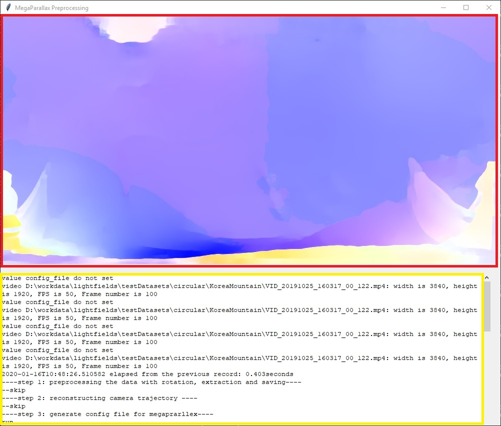
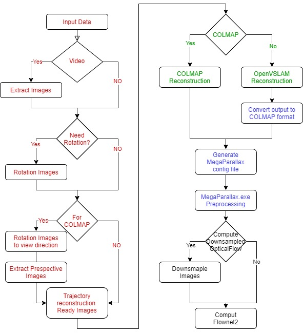
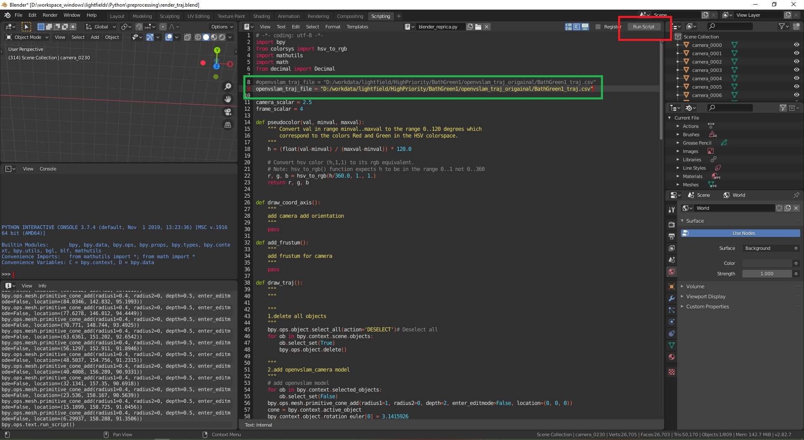
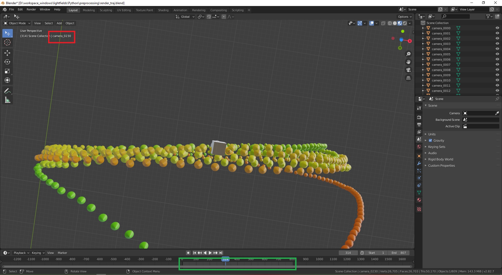

# 0. Introduction

This pre-processing pipeline prepares datasets for OmniPhotos preprocessing from videos captured with a 360° camera, such as an [Insta360 One X](https://www.insta360.com/product/insta360-onex).

The preprocessing application's GUI looks as follows. The red box is the preview window and the yellow is the logging window.




# 1. Exported preprocessing binary

An exported preprocessing binary with all the necessary files can be found [here](release-url).
This folder contains all the necessary software in order to generate the dataset from a 360 video and view it.

The run-time environment for these binaries, and necessary dependencies, are as follows:
The default version of runtime 3rd-party software:

- **Platform**: Windows 10 amd64
- **ffmpeg**: 4.2.1 (see section 2.6 below)

All other depencies should be provided in the exportable folder.


In order to run this, first download and extract the preprocessing binary folder.
Secondly extract the video according to 2.1 below. 
Thirdly, copy the `python-config` template from the preprocessing binary folder to the same directory as the video, change the `preprocessing.input_path`
in the config to the name of your video and run:

```
   path/to/preproc/preproc.exe -c path/to/config.yaml
```

## 1.1 Updating the Preproc Binary

In order to generate a new binary from the python code, first set up a python environment according to the instructions below. 
Following this install pyinstaller with pip:

```
   pip install pyinstaller
```

Then run:

```
   pyinstaller main.py --name preproc
```
from this directory.
This will generate a new `dist/` directory in `preprocessing/` containing the directory `preproc` with all the necessary dlls and binaries. 
You will need to make a copy of the `template/` directory to the `preproc/` directory as well:

```
   cp -r template dist/preproc/
```

The config template provided assumes the openvslam and omniphotos binaries are in the same directory so these should be copied to the `dist/` directory.

Below are instructions to install and run the package using Python. 

# 2. Run-time environment

The default version of runtime 3rd-party software:

- **Platform**: Windows 10 amd64
- **Python version**: 3.7.5
- **COLMAP version**: 3.6-dev.3
- **OpenVSLAM Version**: 1.2-rc1
- **Insta360 Studio 2019 Version**: Windows v3.4.2
- **ffmpeg**: 4.2.1
- **Blender**: 2.8 or later


## 2.1. Insta360 Studio 2019

Get 'Insta360 Studio 2019' from the [official website](https://www.insta360.com/download/insta360-onex).
We use Insta360 Studio version **3.4.2**.
At some point between versions **3.4.2** and **3.4.6**, the `FlowState stabilisation` stopped keeping the camera up direction vertical, but instead tilts the video.
To keep the exported video upright, export the video with Insta360 Studio **3.4.2** with `FlowState stabilisation` and without `Direction Lock`.


## 2.2. Python

Download the installer from [Python official website](https://www.python.org/downloads/).
After setup the python, run the following command to initialise the Python virtual environment and install the necessary packages of the preprocessing script.

```
python -m venv python3_7_omniphotos_preprocessing
python3_7_omniphotos_preprocessing\Scripts\activate
python -m pip install -r ./requirements.txt
```

Alternatively, Anaconda can be used in order to install the packages.
The Anaconda distribution for Windows can be installed from [here](https://www.anaconda.com/products/individual#windows).
Once it is installed, launch the Anaconda Prompt and run the following commands:

```
conda create --name py375 python=3.7.5
conda activate py375
pip install -r ./requirements.txt
```


## 2.3. OpenVSLAM

Download the OpenVSLAM source code from the [official website](https://github.com/xdspacelab/openvslam) and set up following the official installation guide in Linux.
Meanwhile, apply the patches in the `openvslam` folder to the official source code:
- Put the files `image_util.cc` and `image_util.h` into `example\util`, replacing the original files;
- Put the files `run_camera_pose_reconstruction.cc` and `run_camera_pose_reconstruction_video.cc` into the `example` folder;
- Use the `openvslam.patch` file to change the `example\CMakeLists.txt` file.

If you run OpenVSLAM on Windows you can download the modified OpenVSLAM's pre-built binaries from [openvslam-bin-dd8af1c](https://drive.google.com/file/d/1gQU4SVQqAD3i9jgSNwDvYc1596C27QfE/view?usp=sharing).


## 2.4. COLMAP

Download the pre-built COLMAP `3.6-dev.3` from [GitHub](https://github.com/colmap/colmap/releases), and download the Vocabulary Trees files `Vocabulary tree with 1M visual words` from the [official COLMAP website](https://demuc.de/colmap/).


## 2.5. FlowNet2

The pre-processing script optionally uses [flownet2-pytorch](https://github.com/NVIDIA/flownet2-pytorch) to compute optical flow.
The pre-trained models can be downloaded from [GitHub](https://github.com/NVIDIA/flownet2-pytorch#converted-caffe-pre-trained-models).

The pre-built FlowNet2-PyTorch is included in the `Python\preprocessing\flownet2` of this project.
The PyTorch python package contains all run-time dependencies of CUDA and CUDNN.

Pre-built *.pyd with following environment:
- windows_x64;
- MSVC 14.2;
- CUDA: 9.2;
- python 3.7;
- `PyTorch 1.3.1` for window_x64, CUDA 9.2 (install instruction:
`python -m pip install torch==1.3.1+cu92 torchvision==0.4.2+cu92 -f https://download.pytorch.org/whl/torch_stable.html`).

If you need other versions, please get more information from the [official FlowNet2-PyTorch website](https://github.com/NVIDIA/flownet2-pytorch).


## 2.6. FFmpeg

The pre-processing script is dependent on the Python interface of FFmpeg (`ffmpeg-python`), which depends on the `ffmpeg.exe` and `ffprob.exe` files.

Please download the FFmpeg windows-x64-static binary package from the [official FFmpeg webside](https://www.ffmpeg.org/download.html).
And add the root folder of ffmpeg.exe to the `PATH` environment variables of Windows.


## 2.7. OmniPhotos

This dataset preprocessing script will call the OmniPhotos `Preprocessing` program to generate the sphere fitting mesh, etc.  
Please download the OmniPhotos binaries or build OmniPhotos from source, and replace the absolute path of `Preprocessing.exe` in **config_omniphotos.yaml** with yours.


# 3. Dataset preprocessing

There are two kinds of preprocessing:
1. The input video captures contains multiple circles/swings, so we need additional steps to select the best circle motion, as described in [Section 3.2](#32-selecting-the-best-circle-openvslam-only).
2. The input video or image sequence only contains a single circular camera motion.
   The preprocessing steps are described in [Section 3.1](#31-preprocessing-steps).


## 3.1. Preprocessing steps

There are 4 steps in the pre-processing pipeline :

1. <span style="color:red">**Prepare Data** (Red)</span>: Prepare images ready for OpenVSLAM/COLMAP, including rotation image, extracting perspective images etc.;
2. <span style="color:green">**Trajectory reconstruction** (Green)</span>: Reconstruct the camera trajectory with OpenVSLAM/COLMAP and output the raw trajectory files;
3. <span style="color:blue">**Core files generation** (Blue)</span>: Generate OmniPhotos configuration files and convert other files to OmniPhotos dataset;
4. <span style="color:black">**Optical flow (FlowNet2)** (Black)</span>: Compute the optical flow with FlowNet2 or any other technique.




### 3.1.1. YAML configuration file

The `config_omniphotos.yaml` YAML configuration file controls all pre-processing steps and settings.
Before running the script, copy the OmniPhotos preprocessor configuration file `config_omniphotos.sample.yaml` from the current folder to the root of the dataset folder, and rename it to `config_omniphotos.yaml`.

Then, change the options of `config_omniphotos.yaml` based on the dataset.
Also change the YAML file path in the `run.bat` batch file.
For more detail, please refer to `config_omniphotos.sample.yaml`.

The conventions of `config_omniphotos.yaml`:
1. File paths in the configuration file `config_omniphotos.yaml` should end with '_path', directory/folder settings should end with '_directory' and their values with either "\\" or "/";
2. If the output data already exist, the preprocessing program will overwrite them without warning;
3. The working root folder is the parent directory of `config_omniphotos.yaml`.


### 3.1.2. Preparing data

This step will extract/transform video/image sequence to trajectory ready images and OmniPhotos Preprocessing ready files.
More configuration detail can be found by referencing the `preprocessing.*` options in the `config_omniphotos.sample.yaml` file.

The raw input data is either video or an image sequence:


1. **Video**

Open `*.insv` with `Insta360 Studio 2019`, select & clip & export the episode of video to an `mp4` file.
When exporting the video, enabling the option **FlowState stabilisation** makes the stitched video always face to the same direction.
Recommended resolution is the native video resolution (3K/4K/maybe even 5.7 K).
Finally, move or copy the `*.mp4` file to the root directory and change the `preprocessing.input_path` to the video name.
For more Insta360 tutorial, please reference [Insta360 Studio 2019 Tutorial](https://www.insta360.com/support/supportcourse?post_id=11139).

There are options corresponding to extracting images from the video:
  - rotating with parameters `preprocessing.image_rotation` 
  - save to `Input` folder with the `preprocessing.original_filename_expression` file name expression for OpenVSLAM reconstruction;
  - When using COLMAP to reconstruct the camera trajectory, it will extract perspective images from the `Input` images and save them to `colmap_perspective` folder.  The perspective images' position is decided by `preprocessing.colmap.perspective_forward`.


2. **Image sequences**

Store the images in the root and change the corresponding options in the `config_omniphotos.sample.yaml` file.


### 3.1.3. Trajectory reconstruction

Call COLMAP and/or OpenVSLAM to reconstruct the camera's trajectory from the video/images generated by the previous step.
Please reference the configuration of `preprocessing.colmap.*` and `preprocessing.openvslam.*` options in the `config_omniphotos.sample.yaml` file.

When using OpenVSLAM, please refer to [Section 3.2](#32-selecting-the-best-circle-openvslam-only) and [Section 3.3](#33-openvslam-reconstruction) to generate two files `map.msg` and `frame_trajectory.txt` in the directory `Capture\openvslam` at the root of dataset folder.

When using COLMAP to reconstruct, copy the COLMAP export txt format model to `Capture\colmap` at the root of dataset folder.
If the COLMAP reconstruction failed, change the variable `frame_interval` and run the second step again.


### 3.1.4. OmniPhotos files generation

This generates the configuration files for OmniPhotos as described in [Section 3.1.2](#312-omniphotos-ready-folder-structure).
It converts the OpenVSLAM raw output data to OmniPhotos style.
Finally, OmniPhotos `Preprocessing` is called to generate the Camera.csv and sphere-fitting mesh, etc.

For configuration, please refer to the `preprocessing.omniphotos.*` options in the `config_omniphotos.sample.yaml` file.


### 3.1.5. Optical flow (FlowNet2)

The script will read the `Camera.csv` file and call FlowNet2 to compute the optical flow.
The optical flow will store to `*.flo` files in the `Cache` folder.

For configuration of FlowNet2, please reference the `preprocessing.of.*` options in the `config_omniphotos.sample.yaml` file.


## 3.2. Selecting the best circle (OpenVSLAM only)

This section only applies to camera trajectories reconstructed with OpenVSLAM.

In most cases, the captured video contains multi-circle camera motion.
Before continuing with the preprocessing, we need to select the best camera motion circle. 
There are two options for doing this:

### 3.2.1 Selecting the circle automatically (Recommended)

To select the best circle automatically, the option `preprocessing.find_stable_circle` should be set to `True`. 
The script will then find the `frame_trajectory.txt` file, select the best circle in the camera path and continue with the next step of the preprocessing. The script will generate some files in the `Capture\` subdirectory of the dataset. 
These include a heatmap showing the errors of different intervals where the location of the best circles are shown as red dots. 
The values for these intervals can be found in the `best_intervals.csv` file. 
If the automatic circle selection has failed, set the `preprocessing.find_stable_circle` option to `False` and follow the manual method in the next section.

### 3.2.2 Selecting the circle manually (Optional)

To select the best stable cycle from the OpenVSLAM camera trajectory manually, use the `rander_traj.blend` file to visualise the reconstructed result.

1. Use Insta360 Studio ([Section 3.1](#31-preprocessing-steps)) to stitch the complete video to reconstruct all camera poses with OpenVSLAM.
   This step will generate two files, `map.msg` and `traj.csv`.

2. Open the Blender project `render_traj.blend` in the current folder to visualise the camera pose.
   In Blender's script Editor tab, edit the python code to assign the absolute path of the `frame_trajectory.txt` to the variable `openvslam_traj_file` (highlighted with a green box in the image), and update video's FPS info `video_fps` if necessary.
   Then click the `Run script` button (highlighted with a red box) to render the camera objects.

   

3. Change Blender to **layout** tab and select the frame within the **Timeline panels**, as shown in the green box.
   Then, get the camera index from the camera name, as shown in the red box.
   If the camera's 3D objects stack together, change the parameters `camera_scalar` and `frame_scalar` in the Python script to a smaller value, and change the `coordinate_scalar` to a bigger value.
   Then run the script again.

   
  
   Blender names the camera object by frame index number, so copy the start and end frame index of the circle and write to the OmniPhotos YAML file's options:
   ```
   preprocessing.frame_index_start: 0
   preprocessing.frame_index_end: -1
   ```


**Criteria for circle selection:**
1. The up-right direction should fit with the scene's up direction;
1. The variance of camera position & direction should be small; camera spacing as uniform as possible (uniform angular spacing, no big vertical jump in position);
1. the gap between the first frame and last frame should be small but no less than half of average camera spacing; no overlap between both ends of the circle;
1. make the cut as hidden as possible, in the least interesting direction of the video (e.g. far-away or uniform textures).


## 3.3. OpenVSLAM reconstruction

By default, we use OpenVSLAM to reconstruct the camera pose.


### 3.3.1. Reconstructing the camera pose

Run OpenVSLAM to get the camera pose, it will output two files: `map.msg` and `traj.csv`.

The `run_camera_pose_reconstruction_video.exe` command calls the 2-step reconstruction we use.
These are the options:

- `-v` is the absolute path of the vocabulary tree file.
- `-i` is the video absolute path.
- `-c` is the OpenVSLAM config YAML file; you can get more detail from the OpenVSLAM website.
- `--auto-term` tells OpenVSLAM to auto exit after finish the job.
- `-r` repeat time of reconstruction with the same video, should be more than 1.
- `--trajectory_path` the path of output camera pose CSV file.
- `-p` the reconstructed map file stored as a map database after SLAM.
- `-t` specifies the type of info to be reconstructed, optional [slam|localization|full].


**Step-1 SLAM**

Run the following command to generate the map database and create the `map.msg` file:

```
run_camera_pose_reconstruction_video.exe \
-v D:\workdata\openvslam_data\orb_vocab\orb_vocab.dbow2 \
-i D:\workdata\BeijingBeihai4\VID_20191020_105227_00_152-flowstate.mp4 \
-c D:\workdata\BeijingBeihai4\config.yaml \
--auto-term \
-r 2 \
-p D:\workspace_windows\openvslam\openvslam-bin-dd8af1c\map.msg \
-t slam
```

**Step-2 Location**

```
run_camera_pose_reconstruction_video.exe \
-v D:\workdata\openvslam_data\orb_vocab\orb_vocab.dbow2 \
-i D:\workdata\BeijingBeihai4\VID_20191020_105227_00_152-flowstate.mp4 \
-c D:\workdata\BeijingBeihai4\config.yaml \
--auto-term \
-r 1 \
--trajectory_path D:\workspace_windows\openvslam\openvslam-bin-dd8af1c\traj.csv \
-p D:\workspace_windows\openvslam\openvslam-bin-dd8af1c\map.msg \
-t localization
```

### 3.3.2. Data mask (optional)

To remove the photographer and reduce outlier points, we can use a mask image for each frame to ignore points in a given region.
The mask images should be stored in the same way as the video and named `mask_images`.
If there are mask images for each frame, they are named by the frame index, e.g. `1200.png`.
The index starts at 0.
When using a single image mask for the whole video, the image should be named `uniform.png`.
The image needs to be in `*.png` format, grayscale (1 channel) with 1 bit per channel.

Input parameters:
- initial mask image: `*.png` format;
- camera trajectory file;
- lock direction or not;

The output files:
- Mask images: `*.png` format, compress level 9.


# 4. Conventions

The convention of the directory structure and development.


## 4.1. Directory structure

Introducing the folder structure of preprocessing data and processed data.


### 4.1.1. Preprocessing folder structure

There are 3 kinds of folder in the whole preprocessing program:

1) original data folders;
2) intermediate product folders, including:
   - trajectory reconstruction ready folder;
   - OmniPhotos-preprocessing ready folder;
   - FlowNet2 ready folder.

3) OmniPhotos-viewer ready folders.
   The cache directory name follows the convention: `NumImages-InputImageResolution-OpticalFlowResolution-FlowMethod`, e.g. `87-4k-2k-DIS`.
   The resolution abbreviation are:
   - 5_7k = 5760×2880
   - 4k = 3840×1920
   - 2K = 1920×960
   - 1k = 960×480

The folders outline and corresponding contents show as following:

```
KyotoShrines                                         # defines the name of the dataset
|
├── Capture    
│   ├── COLMAP   
│   └── openvslam                                      
|
├── Capture_backup                                   # folder storage the loaded data for OmniPhotos;
│   ├── COLMAP                                       # COLMAP output folder storage the configuration & data files for OmniPhotos;
│   │   ├── full-model                               # the reconstructed result, store with the binary file of output
│   │   │   ├── cameras.bin                          # binary file of output
│   │   │   ├── images.bin                           # binary file of output
│   │   │   └── points3D.bin                         # binary file of output
│   │   │ 
│   │   ├── cameras.txt                              # COLMAP output parameters of camera, used by OmniPhotos
│   │   ├── images.txt                               # text file of COLMAP output image info, used by OmniPhotos
│   │   ├── points3D.txt                             # text file of COLMAP output 3D points, used by OmniPhotos
│   │   ├── project.db                               # COLMAP database file
│   │   ├── project.ini                              # project file of COLMAP
│   │   └── snapshot.png                             # snapshot of reconstructed map
│   │
│   └── openvslam                                    # folder storage the configuration & data files for OmniPhotos;
│       ├── cameras.txt                              # (auto-generated) parameters of camera, used by OmniPhotos camera type and intrinsic parameters;
│       ├── config.yaml                              # configuration file of openvslam
│       ├── frame_trajectory.txt                     # the reconstructed camera pose, with the new format containing image file name;
│       ├── frame_trajectory_filename.txt            # camera pose with explicate corresponding filename
│       └── map.msg                                  # the reconstructed map information, used to load 3D-point positions.
|
├── Config                                               # configuration files for OmniPhotos
│   ├── config-viewer.yaml                               # settings used for Preprocessing and Viewer
│   ├── modelFiles.openvslam                             # contains paths to OpenVSLAM reconstruction
│   └── modelFiles.txt                                   # contains paths to COLMAP reconstruction
│ 
├── colmap_perspective                               # extracted perspective image, used by COLMAP
│   ├── original-0001.png                            # perspective image corresponding the images in Input directory
│   ├── ..........
│   └── original-0005.png
│ 
├── original_images                                  # the folder contain the original input images for per-processing step
│   │                                                # if input type is video the folder storage the extracted images
│   │                                                # if input type is image the folder storage the original images
│   ├── input-0001.png                               # perspective image for the input of OpenVSLAM & COLMAP
│   ├── ..........
│   └── input-0005.png
│ 
├── trajectory_images                                # the folder contain the original input images for per-processing step
│   │                                                # if input type is video the folder storage the extracted images
│   │                                                # if input type is image the folder storage the original images
│   ├── input-0001.png                               # perspective image for the input of OpenVSLAM & COLMAP
│   ├── ..........
│   └── input-0005.png
│ 
├── Input_backup                                     # the folder contain the down-sampled original images if need down sample the input images
│   ├── input-0001.png
│   ├── ..........
│   └── input-0005.png
│ 
└── Input                                            # the input sequence panoramic images for the OmniPhotos as the final output of preprocessing step, the name should be corresponding the configuration in the YAML file
    ├── original-0001.png                            # the name is corresponding the "op_filename_expression" option 
    ├── original-0002.png
    ├── ..........
    ├── ..........
    └── original-0005.png
```


### 4.1.2. OmniPhotos-ready folder structure

The OmniPhotos-ready dataset trimmed the cache and redundant data, and removed unnecessary data.

```
KyotoShrines                                             # defines the name of the dataset
│
├── Cache                                                # preprocessing data of OmniPhotos
│   ├── 91-4k-2k-DIS                                     # see naming convention above
│   │   ├── Cameras.csv                                  # camera poses, in OmniPhotos coordinates
│   │   ├── panoramic-0695-FlowToNext.floss              # optical flow from this image to the next
│   │   ├── panoramic-0695-FlowToPrevious.floss          # optical flow from this image to the previous
│   │   ├── ...
│   │   ├── panoramic-1231-FlowToNext.flo
│   │   ├── panoramic-1231-FlowToPrevious.flo
│   │   ├── PointCloud.csv                               # point cloud, in OmniPhotos coordinates
│   │   ├── PreprocessingSetup-0091.json                 # preprocessed dataset information
│   │   ├── spherefit-d2d-loss1-[...].obj                # fitted proxy geometry
│   │   ├── spherefit-d2d-loss1-[...]-log-scaled-cm.png  # log-depth map visualisation of proxy
│   │   └── spherefit-d2d-loss1-[...]-points.obj         # input points for proxy geometry (debug vis)
│   │
│   └── 91-4k-2k-FlowNet2                                # see naming convention above
│       └── ...
│
├── Capture                                              # reconstruction result of COLMAP & openvslam
│   ├── COLMAP                                           # COLMAP reconstruction
│   │   ├── cameras.txt                                  #
│   │   ├── images.txt                                   #
│   │   └── points3D.txt                                 #
│   │
│   └── openvslam                                        # OpenVSLAM reconstruction
│       ├── cameras.txt                                  #
│       ├── frame_trajectory_with_filename.txt           #
│       └── map.msg                                      #
│
├── Config                                               # configuration files for OmniPhotos
│   ├── config-viewer.yaml                               # settings used for Preprocessing and Viewer
│   ├── modelFiles.openvslam                             # contains paths to OpenVSLAM reconstruction
│   └── modelFiles.txt                                   # contains paths to COLMAP reconstruction
│
└── Input                                                # panoramic input images
    ├── panoramic-0695.png
    ├── ...
    └── panoramic-1231.png
```

## 4.2. Development

The coding convention used is the [Google Python Style Guide](http://google.github.io/styleguide/pyguide.html).

Variables convention:
- The index of image start from 0.


# 5. FAQs

## 5.1. Skylibs importing error 

**Description:**
error message "OSError: cannot load library y:\xxxxxxxxxxxx\skylibs\ezexr\libstdc++-6.dll: error 0x7e"

**Solution:**
Get the `*.dll` file from [GitHub skylibs](https://github.com/soravux/skylibs) and 
copy to the python directory `\python3_7_OmniPhotos_preprocessing\Lib\site-packages\ezexr`.

Change the dll loading sequence of ezexr initialization, loading the `libgcc_s_sjlj-1.dll` first. 
The `git diff` show as:

```
diff --git a/ezexr/__init__.py b/ezexr/__init__.py
index cd42332..38929f0 100644
--- a/ezexr/__init__.py
+++ b/ezexr/__init__.py
@@ -15,7 +15,7 @@ if os.name == 'nt':
     from cffi import FFI
     ffi = FFI()
     ffi.cdef(cffi_def)
-    to_precache = ["libstdc++-6.dll", "libgcc_s_sjlj-1.dll", "libzlib.dll", "libHalf.dll", "libIex-2_2.dll",
+    to_precache = ["libgcc_s_sjlj-1.dll", "libstdc++-6.dll", "libzlib.dll", "libHalf.dll", "libIex-2_2.dll",
                    "libIlmThread-2_2.dll", "libImath-2_2.dll", "libIlmImf-2_2.dll"]
     [ffi.dlopen(os.path.join(os.path.dirname(os.path.realpath(__file__)), x)) for x in to_precache]
     C = ffi.dlopen(os.path.join(os.path.dirname(os.path.realpath(__file__)), "wrapper.dll"))
```


## 5.2. Runtime errors

1. **Description:** MSVC14.dll

   **Solution:**
      Install the Visual Studio runtime environment [Microsoft Visual C++ Redistributable for Visual Studio 2015, 2017 and 2019](https://aka.ms/vs/16/release/vc_redist.x64.exe)

2. **Description:** cudart.dll

   **Solution:**:
   Add the path of CUDA 9.2 `cudart.dll` to the system path environment variable.


## 5.3. Data visualisation

**Description:**
How to open COLMAP `*.bin` files?

**Solution**: 
The `*.bin` files composing with 3 bin files: `cameras.bin`, `images.bin` and `points3D.bin`.

Import *.bin files with COLMAP-GUI:
`File`->`Import Model`-> Select the *.bin storage folder -> `Select Folder`?


## 5.4. MsgPack

**Description:**
when load \*.msg file, error " xxxx  exceeds max_bin_len(xxxx) "

**Solution:**
`pip install msgpack==0.5.6`
