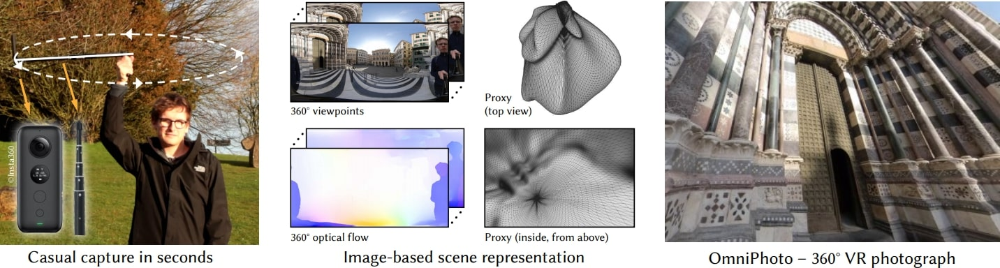

# OmniPhotos: Casual 360° VR Photography
### [Project Page](https://richardt.name/publications/omniphotos/) | [Video](https://vimeo.com/456866335) | [Paper](https://richardt.name/publications/omniphotos/OmniPhotos-BertelEtAl-SIGAsia2020-paper.pdf) | [Demo](#demo) | [Data](https://doi.org/10.15125/BATH-00948)


This repository contains the source code for creating and viewing OmniPhotos – a new approach for
casual 360° VR photography using a consumer 360° video camera.

**OmniPhotos: Casual 360° VR Photography**  
[Tobias Bertel](https://tobias-bertel.com/), [Mingze Yuan](https://yuanmingze.github.io/), Reuben Lindroos, [Christian Richardt](https://richardt.name)  
_ACM Transactions on Graphics (SIGGRAPH Asia 2020)_




## Demo 

The quickest way to try out OmniPhotos is via our [precompiled demo (610 MB)](https://github.com/cr333/OmniPhotos/releases/download/v1.0/OmniPhotos-Demo-v1.0.2-win10-x64.zip).
Download and unzip to get started.
Documentation for the precompiled binaries, which can also be [downloaded separately (25 MB)](https://github.com/cr333/OmniPhotos/releases/download/v1.0/OmniPhotos-v1.0.2-win10-x64.zip), can be found [here](docs/demo/README.md).

For the demo to run smoothly, we recommend a recently updated Windows 10 machine with a discrete GPU.


### Additional OmniPhotos

We provide 31 OmniPhotos for download:
* [9 preprocessed datasets](https://researchdata.bath.ac.uk/948/5/Preprocessed.zip) that are ready for viewing (3.2 GB zipped, 12.8 GB uncompressed)
* [31 unprocessed datasets](https://researchdata.bath.ac.uk/948/6/Unprocessed.zip) with their input videos, camera poses etc.; this includes the 9 preprocessed datasets (17.4 GB zipped, 17.9 GB uncompressed)

**Note:** A few of the .insv files are missing for the 5.7k datasets. If you need to process these from scratch (using the insv files) these files can be found [here](https://www.dropbox.com/sh/uz6lh0e0fbguir9/AABcWBGFy6fdLejOmS0zQioqa?dl=0). 

### How to view OmniPhotos

OmniPhotos are viewed using the "Viewer" executable, either in windowed mode (default) or in a compatible VR headset (see below).
To run the viewer executable on the preprocessed datasets above, run the command:
	
	Viewer.exe path-to-datasets/Preprocessed/

with paths adjusted for your machine.
The viewer will automatically load the first dataset in the directory (in alphabetical order) and give you the option to load any of the datasets in the directory.

If you would like to run the viewer with VR enabled, please ensure that the firmware for your HMD is updated, you have SteamVR installed on your machine, and then run the command:

	Viewer.exe --vr path-to-datasets/Preprocessed/

The OmniPhotos viewer can also load a specific single dataset directly:

```
Viewer.exe [--vr] path-to-datasets/Preprocessed/Temple3/Config/config-viewer.yaml
```


### How to preprocess datasets

If you would like to preprocess additional datasets, for example "Ship" in the "Unprocessed" directory, run the command:

	Preprocessing.exe path-to-datasets/Unpreprocessed/Ship/Config/config-viewer.yaml

This will preprocess the dataset according to the options specified in the config file.
Once the preprocessing is finished, the dataset can be opened in the Viewer.

For processing new datasets from scratch, please follow the detailed documentation at [Python/preprocessing/readme.md](./Python/preprocessing/readme.md).


## Compiling from source

The OmniPhotos `Preprocessing` and `Viewer` applications are written in C++11, with some Python used for preparing datasets.

Both main applications and the included libraries use [CMake](https://cmake.org/) as build system generator.
We recommend CMake 3.16 or newer, but older 3.x versions might also work.

Our code has been developed and tested with Microsoft Visual Studio 2015 and 2019 (both 64 bit).


### Required dependencies

1. [GLFW 3.3](http://www.glfw.org/) (version 3.3.1 works)
2. [Eigen 3.3](http://eigen.tuxfamily.org) (version 3.3.2 works)
   * *Please note:* Ceres (an optional dependency) requires Eigen version "3.3.90" (~Eigen master branch).
3. [OpenCV 4.2](https://opencv.org/)
   * OpenCV 4.2 includes DIS flow in the main distribution, so precompiled OpenCV can be used.
   * OpenCV 4.1.1 needs to be compiled from source with the `optflow` contrib package (for DIS flow).
   * We also support the CUDA Brox flow from the `cudaoptflow` module, if it is compiled in. In this case, tick `USE_CUDA_IN_OPENCV` in CMake.
4. [OpenGL 4.1](https://www.opengl.org/): provided by the operating system
5. [glog](https://github.com/google/glog) (newer than 0.4.0 master works)
6. [gflags](https://github.com/gflags/gflags) (version 2.2.2 works)


### Included dependencies (in `/src/3rdParty/`)

1. [DearImGui 1.79](https://github.com/ocornut/imgui): included automatically as a git submodule.
2. [GL3W](https://github.com/skaslev/gl3w)
3. [JsonCpp 1.8.0](https://github.com/open-source-parsers/jsoncpp): [almalgamated version](https://github.com/open-source-parsers/jsoncpp/wiki/Amalgamated-(Possibly-outdated))
4. [nlohmann/json 3.6.1](https://github.com/nlohmann/json)
5. [OpenVR 1.10.30](https://github.com/ValveSoftware/openvr): enable with `WITH_OPENVR` in CMake.
6. [TCLAP](http://tclap.sourceforge.net/)
7. [tinyfiledialogs 3.3.8](https://sourceforge.net/projects/tinyfiledialogs/)


### Optional dependencies

1. [Ceres](http://ceres-solver.org/) (with SuiteSparse) is required for the scene-adaptive proxy geometry fitting. Enable with `USE_CERES` in CMake.
2. [googletest (master)](https://github.com/google/googletest): automatically added when `WITH_TEST` is enabled in CMake.


## Citation

Please cite our paper if you use this code or [any of our datasets](https://doi.org/10.15125/BATH-00948):

```bibtex
@article{OmniPhotos,
  author    = {Tobias Bertel and Mingze Yuan and Reuben Lindroos and Christian Richardt},
  title     = {{OmniPhotos}: Casual 360° {VR} Photography},
  journal   = {ACM Transactions on Graphics},
  year      = {2020},
  volume    = {39},
  number    = {6},
  pages     = {266:1--12},
  month     = dec,
  issn      = {0730-0301},
  doi       = {10.1145/3414685.3417770},
  url       = {https://richardt.name/omniphotos/},
}
```

## Acknowledgements

We thank the reviewers for their thorough feedback that has helped to improve our paper. We also thank Peter Hedman, Ana Serrano and Brian Cabral for helpful discussions, and Benjamin Attal for his layered mesh rendering code.

This work was supported by EU Horizon 2020 MSCA grant FIRE (665992), the EPSRC Centre for Doctoral Training in Digital Entertainment (EP/L016540/1), RCUK grant CAMERA (EP/M023281/1), an EPSRC-UKRI Innovation Fellowship (EP/S001050/1), a Rabin Ezra Scholarship and an NVIDIA Corporation GPU Grant.
