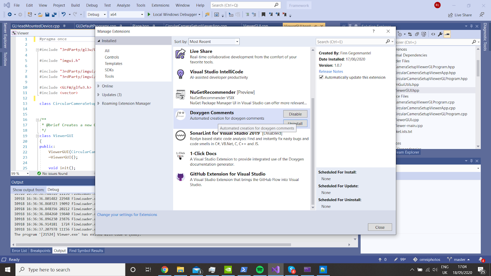

# Building Documentation

To build the documentation, you'll first of all need to have installed doxygen, using [this](https://www.doxygen.nl/download.html) link (making `doxygen.exe` available on your path). [This](https://www.doxygen.nl/manual/install.html) link could be helpful as well. To check the '.exe' is on your path, run this command and make sure it does not return an error:
    
    doxygen --version

Then run the command 
	
	doxygen

or 

    doxygen Doxyfile

in the `docs/` directory.

## Read the docs 

RTD virtual machines read the sphinx `conf.py` file and generate the documentation using this. We've injected the call to doxygen into this file. The doxygen
binary is then executed in the docs directory and generates files in the `docs/html/` directory, replacing the generated sphinx html files with those build by doxygen.

# Writing Documentation

### Getting started:

In order to create a doxygen code stump, use the **Doxygen Comments** extension found in the online extension manager. It is not necessary to use this, but it seems to be the easiest option:

The extension will generate a stub whenever you type `/**` and press enter above a function/variable/class.  If you type it at the top of a header file it will generate a more detailed stump.

The stumps can be customized Tools->Options and selecting Doxygen in the left hand pane.

*Other Option*: Use Visual Studio Plugins **1-Click Docs**. You can use the **1-Click Docs** extension to call `doxygen.exe` in Visual Studio. For more information please reference https://www.doxygen.nl/manual/starting.html.

There is a demo project (https://github.com/yuanmingze/codestyle_demo) for Doxygen use. And the tutorial of how to use Doxygen in Visual Studio 2019 please reference the project's README.md file.

## Doxygen Conventions

### 1. C/C++

All documentation for classes should be located in the header files.

The convention that has been used for the documentation has been the javadoc style:

	/**
	* A brief history of JavaDoc-style (C-style) comments.
	*
	* This is the typical JavaDoc-style C-style comment. It starts with two
	* asterisks.
	*
	* @param theory Even if there is only one possible unified theory. it is just
	* a set of rules and equations.
	*/
	void cstyle( int theory );

The source code and further elaboration on this style can be found here: 
https://www.doxygen.nl/manual/docblocks.html

Each class method should have a documentation string one line above it, as shown above. The description for the function should be succinct and define what the purpose of the function is, what @param is being used in it and why it is there. If there is a @return value this should be explained here as well. The “@” symbol has been used to designate the fields. 

Single line comments should be added before class variables as well: 

	/** List of supported rendering methods.*/ 	
	std::vector<std::string> methods;

Note that for a class to appear as "documented" in the "Class Index" list and "Class Hiearchy" lists in Doxygen, you'll need to add a `@brief` descriptor in the line directly before the class declaration (in the hpp). 

	/**
	 * @brief this is a class
	 */
	 class MyClass
	 {

	 }
The `@brief` notation is not strictly necessary, only important for explicity.

At the top of the header file, the following documentation stump can be created, allthough it is not strictly necessary. 

	/*********************************************************************
	 * @file   ViewerGUI.hpp
	 * @brief  Generates a GUI for the Viewer application. 
	 * 
	 * @author authors
	 ********************************************************************/

### 2. Python

The convention of coding is based on the Google Python Style Guide (https://google.github.io/styleguide/pyguide.html).

If you use Visual Studio Code as the coding editor, please reference the official guide to configure the automatic linting functionality (https://code.visualstudio.com/docs/python/linting).
