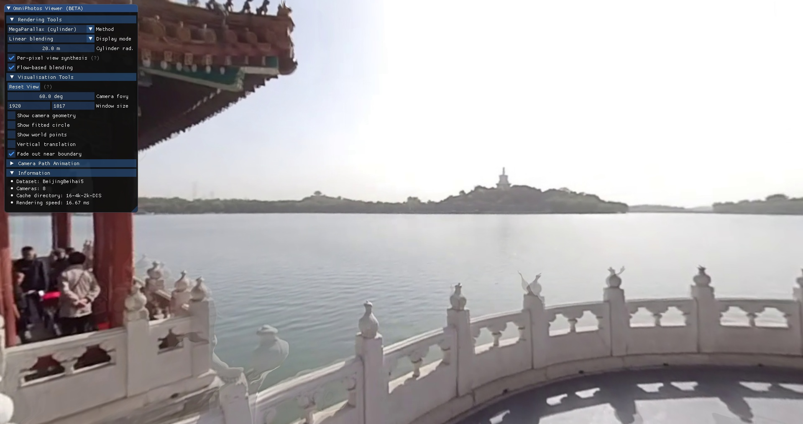
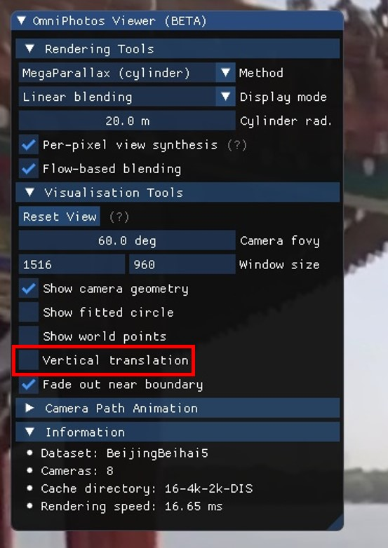
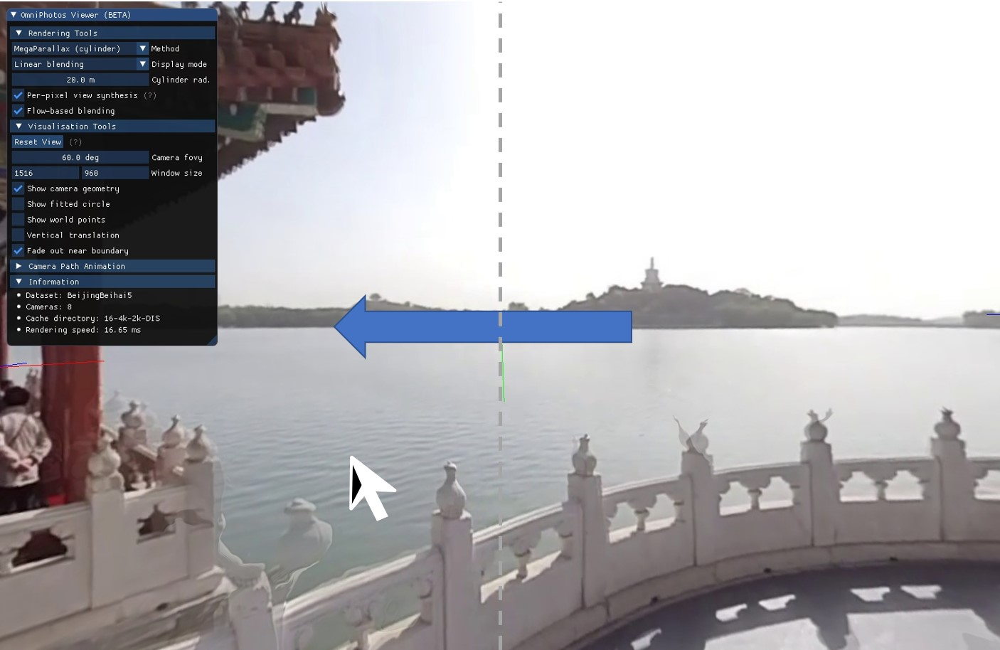
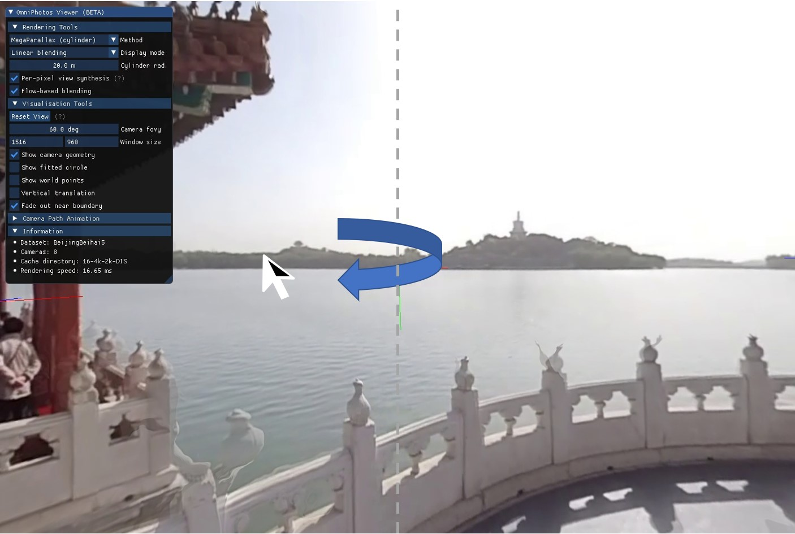
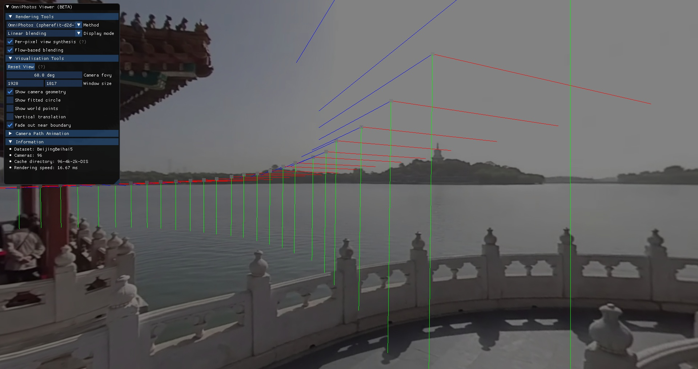
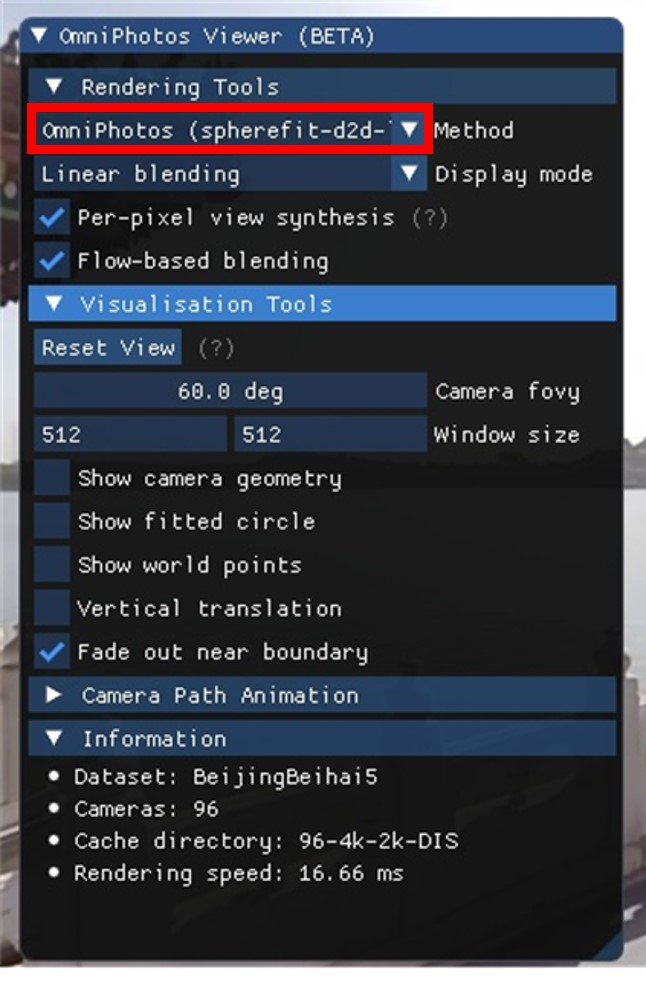
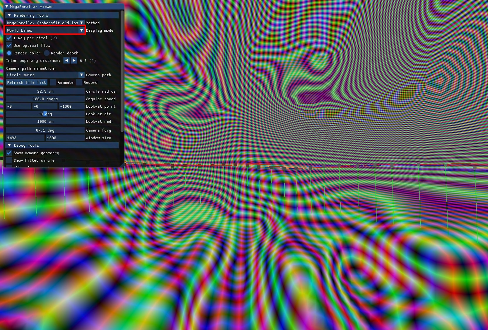
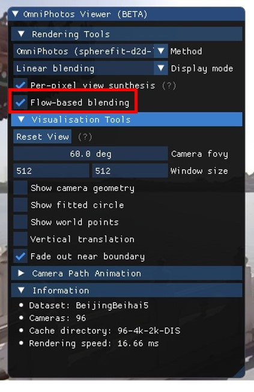

.. OmniPhotos documentation master file, created by
   sphinx-quickstart on Wed Apr  1 13:25:12 2020.
   You can adapt this file completely to your liking, but it should at least
   contain the root `toctree` directive.

.. image :: representative_image.jpg

.. toctree::
   :maxdepth: 3
   :hidden:
   :caption: Contents:

|

########################################
Welcome to the OmniPhotos documentation!
########################################
This page provides documentation for the demo (the files for which can be downloaded `here <https://github.com/cr333/OmniPhotos/releases/download/v1.0/OmniPhotos-Demo-v1.0.2-win10-x64.zip>`_)

####
Demo
####

This tutorial will demonstrate how to use the demo software for this project.

Installation
============
No installation is required. All the binaries and necessary dependencies should be included in the folder that has been distributed. In order for the software to run smoothly we recommend you use Windows 10 with recent updates along with a discrete GPU with recent driver updates.

Usage
=====
 
In order to run the software on a preprocessed dataset without a head mounted display, double click the batch file called `Demo-1-Wulongting.bat`. Note that Windows will warn you with a "Unknown publisher" dialog when running the demos for the first time. Once the script has finished initialising, a window should appear that looks similar to the image below. 

.. note:: There is a second `.bat` file called `Demo-2-Cathedral.bat` which is an unprocessed dataset. This will take a little longer to launch as optical flow needs to be computed prior to launching the viewer. We reccomend you start with the Wulongting dataset as is demonstrated in Demo-1.

Mouse controls
**************

In the debug window there are a number of different options. Under the *Visualisation Tools* dropdown, there is a *Vertical Translation* switch as can be seen in the figure below. Ensure that this is turned off when you are first using the viewer. This can also be achieved by pressing :guilabel:`spacebar`.

With the *Vertical Translation* option set to disabled, pressing anywhere on either half of the screen with the left mouse button will cause the camera to 
translate in that direction. The speed of the movement increases proportionally to the distance from the cursor to the center of the window. Scrolling with the mouse wheel will cause the camera to move forwards or backwards along the viewing direction. 

Pressing the right mouse button will cause the camera to rotate in that direction instead. As with the translation, the speed of this movement increases with the distance of the pointer to the centre of the window. 

You may notice that if you keep translating in one direction the viewer will darken and the scene will no longer appear realistic. This is because the viewer has reached the edge of the camera circle. This camera cirle can be viewed by pressing :guilabel:`m` or checking the *Show camera geometry* box. The viewer can be reset to the center of this circle by pressing :guilabel:`backspace`, :guilabel:`num-1` or the *Reset view* button under *Visualisation Tools*.

Rendering tools
***************

The active method being dislpayed can be changed using the *Method* dropdown menu under the *Rendering tools* tab. The list can also be cycled through using :guilabel:`numpad-0` and :guilabel:`ctrl` + :guilabel:`numpad-0` or the :guilabel:`tab` key.

Different blending methods as well as ways to visualise the data can be selected in the *Display mode* dropdown menu under *Rendering Tools*. For example, the world lines option will display the proxy geometry being used to render the scene. If the spherefit method has been selected (the one the viewer defaults to when started) the viewer should look similar to the image below. 

Optical flow can be toggled on and off using the o-key or by toggling the *Flow-based blending* switch. The change will be most apparent when looking at methods with simpler proxy geometries (i.e cylinder or plane).

Other keybindings
*****************

Some other keyboard shortcuts for the viewer.

+------------------------------------------------+----------------------------------------------------------------+
|                  Key Binding                   |                            Outcome                             |
+================================================+================================================================+
| :guilabel:`left mouse button`                  | Translate the camera left/right perpendicular to the current   |
|                                                | viewing direction whilst remaining in the plane if the         |
|                                                | *Vertical translation* option is switched off.                 |
+------------------------------------------------+----------------------------------------------------------------+
| :guilabel:`right mouse button`                 | Rotate the camera left/right and up/down.                      |
+------------------------------------------------+----------------------------------------------------------------+
| :guilabel:`left arrow` :guilabel:`right arrow` | Move to the left or right.                                     |
+------------------------------------------------+----------------------------------------------------------------+
| :guilabel:`up arrow` :guilabel:`down arrow`    | Move forward or backward.                                      |
+------------------------------------------------+----------------------------------------------------------------+
| :guilabel:`space`                              | Toggle *Vertical translation* mode. This will allow the camera |
|                                                | to move away from the plane of the camera circle.              |
+------------------------------------------------+----------------------------------------------------------------+
| :guilabel:`num_1`, :guilabel:`backspace`       | Reset the camera view.                                         |
+------------------------------------------------+----------------------------------------------------------------+
| :guilabel:`num_0`, :guilabel:`tab`             | Switches between different rendering methods. When             |
|                                                | holding down :guilabel:`ctrl`, this will step                  |
|                                                | backwards through the list.                                    |
+------------------------------------------------+----------------------------------------------------------------+
| :guilabel:`b`, :guilabel:`ctrl-b`              | Cycles through the Display Mode (e.g. type of blending         |
|                                                | being used or various debug outputs). When holding down        |
|                                                | :guilabel:`ctrl`, this will step backwards through the         |
|                                                | list.                                                          |
+------------------------------------------------+----------------------------------------------------------------+
| :guilabel:`h`                                  | Display or hide the blue GUI widget (imgui).                   |
+------------------------------------------------+----------------------------------------------------------------+
| :guilabel:`m`                                  | Display or hide the camera geometry.                           |
+------------------------------------------------+----------------------------------------------------------------+
| :guilabel:`w`                                  | Show world points (generated by OpenVSLAM).                    |
+------------------------------------------------+----------------------------------------------------------------+
| :guilabel:`o`                                  | Toggle use of optical flow for flow-based blending.            |
+------------------------------------------------+----------------------------------------------------------------+
| :guilabel:`r`                                  | Reload OpenGL shaders.                                         |
+------------------------------------------------+----------------------------------------------------------------+
| :guilabel:`f9`                                 | Animate camera along predetermined path. See section *Camera   |
|                                                | Path Animation* in the GUI for supported paths and settings.   |
+------------------------------------------------+----------------------------------------------------------------+
| :guilabel:`f11`                                | Take a screenshot. These are saved in /Screenshots/            |
+------------------------------------------------+----------------------------------------------------------------+

Usage (With HMD)
================

If you would like to use the Viewer in a head-mounted display, please ensure the firmware is updated for your HMD and that you have Steam VR installed on your machine. To launch the viewer on the HMD, use the `XXXX-with-HMD.bat` files. SteamVR should launch automatically. Sometimes there is an error when launching SteamVR for the first time. Please retry the launch if this is the case. 

A companion window should appear on the desktop as well as the scene appearing in the HMD. 

.. important::
   
   Press the :guilabel:`s` key (or the :guilabel:`Left/Right Grip` on the Oculus HMD) in order to recenter the location of the HMD to the center of the camera circle. One should do as soon as a comfortable position has been found with the headset on. 

Press the :guilabel:`tab` (or :guilabel:`Left Trigger` on the Oculus HMD) in order to cycle through the different Methods. The method being used will be printed to the terminal. 

Oculus Keybindings
******************

Some other keybindings, enabled on Oculus VR headsets. 

+------------------------------------------------+-------------------------------------------------------------+
|                   Key Binding                  |                           Outcome                           |
+================================================+=============================================================+
| :guilabel:`Left Trigger`                       | Toggle rendering methods between OmniPhotos and Megastereo. |
+------------------------------------------------+-------------------------------------------------------------+
| :guilabel:`Right Trigger`                      | Toggle display mode between proxy and image rendering.      |
+------------------------------------------------+-------------------------------------------------------------+
| :guilabel:`Left Grip` :guilabel:`Right Grip`   | Recentre the headset to the centre of the camera circle.    |
+------------------------------------------------+-------------------------------------------------------------+
| :guilabel:`B` :guilabel:`A`                    | Go to next/previous proxy                                   |
+------------------------------------------------+-------------------------------------------------------------+
| :guilabel:`X` :guilabel:`Y`                    | Go to next/previous dataset                                 |
+------------------------------------------------+-------------------------------------------------------------+

####
Docs
####

.. doxygenclass:: ViewerApp
   :members:
   :private-members:

.. doxygenclass:: GLApplication
   :members:
   :private-members:

Known Issues
============
Following are some of the issues encountered whilst testing.

Missing VC DLL
**************
When running the viewer, an error dialogue may appear with the text: "The code execution cannot proceed because VCRUNTIME140_1.dll was not found. Reinstalling the program may fix this problem."

In order to fix this you will need to install Microsoft Visual C++ Redistributable for Visual Studio 2015, 2017 and 2019. The executable can be found here: https://aka.ms/vs/16/release/vc_redist.x64.exe. 

Unverified publisher warning
****************************
Since the software has been written by us, a small research group not recognised by Microsoft as an offical publisher of software, this dialogue might appear. Please click okay to proceed.

Error with SteamVR when launching the HMD executable
****************************************************
Please try relaunching the viewer as this error usually resolves itself once SteamVR has been initialised for the first time.
